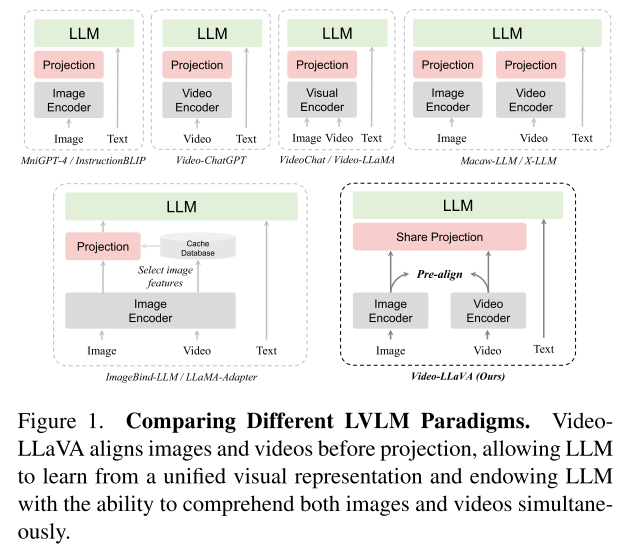

# MultiModal LLMs

提升效果的方法：

1. 更高的图片分辨率（比参数量和数据配比更重要）
2. 更大的模型

编码不可能三角：

- 紧凑、无损、离散

## Preliminary

### ViT

transformer

encoder/decoder

## Core Areas

### 1. Alignment

多模态对齐，旨在将多个模态的embedding映射到同一个空间，通常用在以下任务：

- **检索**：用一个模态去检索另一个模态，比如文字检索图片
- **零样本分类**：给一个模态分类。当模态对齐到文本模态后，可以直接按照语言描述构建类别，省去打标成本。

#### 1.1 Clip

> Learning Transferable Visual Models From Natural Language Supervision

用4亿图文对**训练(from scratch)**的双塔模型，能够在多种视觉任务上实现zero-shot transfer。

- **训练**

  - 用`N=32768(32*1024)`的batchsize训练32epoch。RN50x64的模型在592张v100上训练18天；ViT-L/14的模型在256张v100上训练12天。
  - 训练时，文本是caption; 测试时，文本是a photo of {class}

  - 训练loss是**对称交叉熵损失**，伪代码如下：两个塔的encoder输出feature，通过两个线性层映射到同一个向量空间中，并normalize得到T_e和I_e。由这两个归一化的向量点乘得到向量间的相似度（nxn矩阵）。矩阵中每一行代表一张图片的logits，每一列代表一个文本的logits，计算图像和文本的交叉熵损失并平均。*tips：在计算图片logits的时候，文本的T_e可以认为是线性层的参数，反之亦然。*

  

- **zero-shot prediction**

  - 训练好模型后，当遇到新的图片/类别，只要通过人为简单构建的文本`a photo of {object}`，就可以在文本中匹配到和图片最相符的。这个过程并不需要文本/图片类别是已有的。
  - 匹配的文本数量N不需要和训练一致，不同的文本T_e代表不同的线性层，将I_e转化为logits。

- **tips:**

  - 文本侧的encoder大小在clip中并没有那么重要

#### 1.2 CoOp(Context Optimization)

> Learning to Prompt for Vision-Language Models, [开源代码](https://github. com/KaiyangZhou/CoOp.)

针对CLIP的**Prompt Tuning方案**，仅仅在prompt侧设置可学习参数，不修改网络参数。

- **效果**：仅仅几个shot就能超过手动设定的prompt

- **架构**：在text侧的token层加入随机的/预训练好的可学习token，可以在class前后加。训练loss沿用CLIP的交叉熵损失。

  - Unified context：可学习的token模式都相同
  - Class-specific context：每个类的token初始化不同

  

#### 1.3 LanguageBind(2024-ICLR)

> LANGUAGEBIND: EXTENDING VIDEO-LANGUAGE PRETRAINING TO N-MODALITY BY LANGUAGE- BASED SEMANTIC ALIGNMENT

**微调方案。**将N个模态的特征全部对齐到语言空间（因为文本模态的信息密度最高）的预训练方法，引入多个模态的语义空间将会鲁棒。如下图，语言外其他模态处理流程如下：

1. 将各个模态信息序列化，将其它模态处理成CHW形式，图片分割成patch
2. 用MAE的方法将部分序列mask（ratio 0.5最好）
3. encoder用OpenClip-ViT-large预训练好的参数
4. 用LoRA微调encoder的参数（rank=2最好）

训练其它模态的时候固定语言模态。语言模态采用OpenClip-ViT-Base预训练好的参数，并不修改encoder，直接计算loss去微调其它模态。loss即CLIP的loss（temp为0.07初始化的可学习参数）对齐流程如下：

1. 每个模态都有其对应的gt文本，用来训练其自己的encoder。将所有模态都对齐到固定的文本encoder的输出空间中。
   - <!--就是多个CLIP固定一个文本侧模型，然后加上lora微调和mask-->

**多视角文本描述**，对于视频，除了title和summary外，用OFA生成关键帧caption，用mPLUG-owl生成对视频的描述（prompt输入title和hashtag），用chatGPT精炼文字。该多视角的文本描述

**参数选择**

- epoch：1～3为主流

- batchsize：1024最好，大了没必要

- training strategy：full tuning效果最好，但在学习多个数据集时，LoRA兼顾了训练时间和效果。

  <!--lora能更好地增量学习-->

- 数据集大小：数据集越大，模型学习得越好

#### 1.4 Ovis

> Ovis: Structural Embedding Alignment for Multimodal Large Language Model

### 2. Fusion

多模态融合旨在将各个模态的embedding融合，以获得更好的内容理解能力（往往包括生成任务）。**以融合的阶段划分**，可以分为以下三种：

1. **Early Fusion**：在提取特征前融合，可以让模型学到不同模态间更深层次的关系，但由于原始数据往往维度较高，会增加计算成本、引入噪声。适用于模态间具有紧密时空对应关系的任务，如视频-音频同步识别或多媒体内容检索。
2. **Middle Fusion**：对中间特征融合，往往将特征通过`拼接/加权/注意力`方式结合起来。能一定程度上保留模态的独立特征表达，在较高的抽象层次上融合信息。适用于模态间有一定关联但又各自具有独特表征空间的任务，如图像-文本联合分析或语音-视觉情感识别。
3. **Late Fusion**：在模型决策阶段融合（对logits融合），适用于模态间相互依赖较弱或需要独立模态特征保持纯净的任务。

在MML中，1、2较为常用。

**以融合的方式划分**，可以分为以下两种：

1. **token-level fusion**：encoder输出的feature被转化成token，和text token一起送入LLM
   - **Q-Former**：用一组可学习的query token去将visual token转化为更少的vector
   - **MLP**：用一到两层线性层视觉feature映射到文本embedding的空间中
   - 在文章MM1中指出，token level不同方式带来的提升远没有visual token的数量和图片的分辨率重要
2. **feature-level fusion**：
   - **Cross-Attention**：通过向网络结构中添加模块的方式深度融合。往往用预训练好的LLM的QKV参数来初始化
   - **Learnable Prompt**：在LLaMA-Adapter中提出，用visual信息编码的prompt，和text连接作为前缀送入LLM

多模态融合的任务：

- **VQA**：基于图片和问题给出答案。评估：方法有很多，可以简单计算是否和答案完全一致；可以计算答案和标准答案的子序列相似性，若超过某个阈值则表示一致；可以手动评估，根据0（不一致）、1（部分一致）、2（完全一致）打分。
- **Image Captioning**：输入图片，让模型输出图片的描述。评估：将模型生成的描述和gt描述对比，指标有BLEU、METEOR、ROUGE、CIDEr（nlp的指标）
- **Image-Text/Text-Image Retrieval：** 通过图片/文本召回最相关的文本/图片。

#### 2.1 LLaVA(2023-NIPS)

> Visual Instruction Tuning

LLaVA是一个端到端的多模态模型，输入caption和图，LLM能够输出对图文的理解，比如问答。

本文首先借助gpt生成了多轮对话指令，再基于此对模型进行两阶段微调。

模型架构如下，用一个线性层（Projection W）将图像的embedding映射成text的维度。

训练的任务为自回归损失，即next token prediction

1. **预训练阶段**：固定其它参数，仅仅微调W，用来将图像embedding和文本token对齐
2. **端到端微调**：固定visual encoder参数，微调W和LLM，用来完成QA等任务

#### 2.2 BLIP2()

> BLIP-2: Bootstrapping Language-Image Pre-training with Frozen Image Encoders and Large Language Models

BLIP2提出**Query Transformer**的融合结构，用来融合图像和文本模态。仅仅通过训练Q-former，冻结住文本和图像encoder/decoder就可以很好的融合。如下图，Q-former是一种bottleneck结构，通过两个阶段的训练来完成。

Q-former接受image embedding和text作为输入，将融合的模态作为输出，给decoder生成相应描述。融合的模态dim往往比原始的image embedding小很多，达到了高效提取融合的作用。

- **阶段1：借助Image encoder学习图文表征**

  

  如上图，q-former包括两个transfomer，分别学习图文信息，两者共用self-attn模块，仅仅在不同任务的mask方式不同。左侧的transformer用作encoder，右侧的transformer用作encoder和decoder，本阶段学习三个任务：ITC，ITM和ITG。

  - **ITC**：即CLIP的对比学习loss，用来对齐左右两个transformer的输出。

    对于左边的transformer，假设有32个query，输出的结果是32xdim维的向量；右边的transfomer则用CLS token（1xdim）作为文本的embedding。将32个query每个都和text embedding计算相似度，取最高的pair作为当前图片/文本的正样本pair。负样本选取方法：batch内采样。

    ITC的self-attn输入采用multimodal mask的方式，每个模态只能见到属于自己模态的embedding

  - **ITG**：文本生成的loss，用来根据输入预测下一个输入

    将32个query和text最前面的token一起拼接到text tokens前，输入self-attn。此时每个text token可以看到前面的所有文字和图片，但看不到后面；每个query token只能看到同样代表图片的query token，不能看到文本。

    ITG的self-attn mask到对角线上面的部分

  - **ITM**：判断当前pair的图文是否是匹配的，是一个二分类loss。

    用一个二分类的线性层LC将每个query embedding转化为2维logit，计算logit均值，根据均值计算CE loss。负样本选取方法：在batch内选择一个作为负样本

    ITM的self-attn输入没有mask，为了让query embedding包含图文信息

- **阶段2: 帮助decoder生成文本**

  

  由于在阶段1中，q-former已经学到了图文表征，因此将其通过全连接层映射成text的前缀，输入decoder/encoder，根据生成loss训练q-former和全连接层。可以视作q-former的embedding为soft visual prompt。

  此时的q-former不需要考虑文本的transformer，因为没有用到文本的embedding。

Q-former缺点：

1. 难训练
2. 泛化不好：32个query是有损压缩，q-former可能通过取巧地方式学到bias信息，比如全是猫的图片就认不出狗

#### 2.3 Flamingo（2022-NIPS）

> Flamingo: a Visual Language Model for Few-Shot Learning

- **Perceiver Resampler**

  将不定长度的image token（比如不同帧的视频，不同分辨率的图片）转化为等长的query token。采用cross attention的方式，用learned query对所有的token做attention。

  

- **Gated XATTN-DENSE**

  加在LLM的每个block之前，让LLM逐渐学习到图片模态的信息。同样做Cross-Attention，以Vision输入的embedding作为KV，以text token作为Q.

  - **Tanh gating**: 给每个层的Cross-Attn输出乘以tanh(a)的权重，a是可学习参数，初始化为0. 一开始a=0，LLM完全依赖自己的输出结果，随着a开始改变，图像的信息才开始起作用。

  - Tanh的函数图像如下，作为LSTM中的一个门函数，它的作用是减缓信息退化。相比sigmoid函数，它的二阶导数有效区间要更长一些。

  

#### 2.4 TFN(2017-EMNLP)

> Tensor Fusion Network for Multimodal Sentiment Analysis

早期，模态融合往往是通过简单的concat（下图左）

TFN提出将不同模态的embedding用笛卡尔积乘起来，这样既融合了不同模态，又保留了模态独立的信息。

#### 2.5 ViLBERT(2019)

> ViLBERT: Pretraining Task-Agnostic Visiolinguistic Representations for Vision-and-Language Tasks

将BERT扩展为图文双模态结构，在Conceptual Captions图文对数据集（3.1 million有效数据）上预训练，并通过少量参数微调的方法泛化到, Visual Commonsense Reasoning(VCR), Grounding Referring Expressions, Caption-Based Image Retrieval任务上。

1. **预训练**：用Conceptual Captions图文对数据集进行预训练。预训练任务包括：masked文本预测，masked图像预测，图文对是否匹配预测

   - 图文对是否匹配：取两者输入最前面的token(CLS token)对应的emb，逐元素点乘后送入二分类Linear层做分类。负样本采样自image或者text的随机替换。

   

2. **下游任务泛化**：

   1. **Visual Question Answering(VQA)**：在VQA2.0数据集上，每个COCO图片10个答案，总共1.1 million问题。在此任务上，模型结构将两个CLS token逐元素点乘后送入2层MLP中，让它给出3129个可能答案的预测结果。对于每个答案，计算其与图片真实答案的相似性分数，让模型预测出这个分数。

      <!--作为分类任务来做的话，实际上只是针对数据集划分了答案空间，没有完成对答案的理解呀？-->

   2. 视觉常识推理，指代表达，基于描述的图像检索

3. **模型结构**：采用两个BERT模型，一个处理图一个处理文，中间某些层用co-attn交叉。下图中TRM表示transformer结构。其中文本的TRM结构要更多一些。

   - 图像patch：用目标检测的模型提取出来的各个patch

   

#### 2.6 ALBEF(2021-NIPS)

> Align before Fuse: Vision and Language Representation Learning with Momentum Distillation

提出图文模态融合的方案，提出ITC loss和和动量蒸馏（MoD）方法，不仅在图文检索和图文理解任务上都有良好表现。（CLIP模型在理解任务上表现不佳）

模型结构如图所示，用ViT/Bert based的encoder作为图文的双塔，两者得到的CLS emb都通过线性层降维到256。融合模块采用Bert的后六层初始化，self attn变成cross attn，引入image emb做后续预测。

预训练loss：

- ITC loss：融合前用itc loss对齐两个encoder的emb
- MLM loss：融合后借助图像侧的信息做文本完形填空
- ITM loss：融合后的CLS输出送入二分类线性层做输出
  - 难负样本挖掘：在一个batch内选择similarity高的pair作为负样本。对每个图片都找一个相似但不是gt的text作为难负样本对；同样每个text都找一个难负样本的image. 
  - 让融合层不仅会做理解任务（MLM），也会做检索任务（ITM）

MoD，用来输出普通的预测结果，它有可能是合适的pair但没有打标在gt中。

- 用动量模型的输出作为teacher去对bkb的输出做蒸馏
- 对itc的两个预测结果(i2t,t2i)，以及mlm的预测结果，都用动量模型计算KL散度优化
- 动量模型的更新：bkb的三个encoder的指数滑动平均

**下游任务**

- 图文检索：用ITC+ITM loss微调，检索的时候，用itc score选取topk个候选，用itm score给这k个候选排序。
  - itm score：融合的cls emb经过线性层后输出一个值，这个值经过sigmoid激活函数，计算交叉熵损失（二分类任务无需输出二维向量，输出一个[0-1]之间的值p_i，另一个是1-p_i即可）。有别于多分类任务用的softmax，sigmoid激活函数更适合二分类任务。[sigmoid和softmax](https://blog.csdn.net/Just_do_myself/article/details/123393900)

**互信息理论**：无论是自监督的对比学习，还是多模态的对比学习，可以看作是**同一种内容的不同表示**（数据增强，或者不同模态），学习的目的就是<!--让这些不同表示之间的互信息最大化-->。
本文提出的动态蒸馏达到了这个目的，可以认为是图/文表示的一种补充表示(一种数据增强)，通过蒸馏的方式增大了互信息。

#### 2.7 MoCo(2020-CVPR)

> Momentum Contrast for Unsupervised Visual Representation Learning

文章提到，对比学习可以看作是完成一个字典查询任务，有query q和字典keys: k1,k2,...,kn。正样本对是q和与其唯一匹配的k+，负样本对则是q和k_i。当q和k+距离最近，和k_i距离都远的时候，loss小。也可以看作是n+1分类任务，需要将q分类成k+，在ce loss之外加上log。

本文提出MoCo，相较于传统的负样本（keys）选择方案，本文采用momentum encoder生成负样本。momentum encoder能生成大量具有表征信息的负样本，此外尽可能保持自身参数不变。

- **大量负样本**：MoCo维持一个key队列，包含大量负样本，且持续加入新的负样本，淘汰老的负样本
- **保持自身参数不变**：由于无法对整个队列反向传播，momentum encoder的参数可以直接copy左边encoder的。但是这样效果不好，因为左边的参数在快速迭代，需要保持右边encoder相对稳定才能生成稳定的负样本。

momentum encoder的更新：
$$
\theta_k=m\theta_k+(1-m)\theta_q
$$
其中m是动量参数，取0.999. 反向传播仅仅用来更新query encoder。

#### 2.7 Oscar

#### 2.8 Vison Language Pretraining with triplet contrastive loss

#### 2.9 Mamba

#### 2.10 DALLE

### 3. MultiModal Instruction Tuning

### 4. Generation

- Diffusion 在文本处理比较劣势，无法处理复杂的prompt和多模态的prompt

- 自回归的方式可以直接生成，diffusion需要多次迭代，效率上有所区别

自回归的生成方式可以作为大脑，diffusion这种生成可以作为特定场景的decoder

#### 4.1 DDPM(2022-NIPS)

> Denoising Diffusion Probabilistic Models（去噪扩散模型）

扩散模型（diffusion model）是一种生成图像的策略，它通过得分匹配(Score Matching)技术训练能量模型(Energy-based Models)，然后通过朗之万方程(Langevin Equation)执行从能量模型的采样。理论上扩散模型可以实现任何连续型对象的生成和采样，但当数据维度较大（高分辨率图像）时，很难训练出完备的能量函数；另一方面，通过朗之万方程采样也有较大不确定性，得到的往往是带有噪声的采样结果。因此，传统的扩散模型只在低分辨率图像上做实验。

如今所提到的扩散模型，则是DDPM。相较于传统的扩散模型，DDPM有很多不同之处。

**DDPM是在干什么**

- 模型目的：给定任意随机噪声，都会输出符合训练分布的图片
- 扩散过程：为$x_0$逐步添加噪声，直到变成纯噪声为止（基于规则）
- 去噪过程：将随机噪声逐步去噪，得到图片（基于模型）

**如何加噪**

对于每一步的加噪，进行如下建模：
$$
x_t = \alpha_tx_{t-1}+\beta_t\varepsilon_t,\ \ \  \varepsilon_t\sim \mathcal{N}(0,I)
$$
其中$\varepsilon_t$为服从高斯分布的随机噪音，$\alpha_t,\beta_t>0$且$\alpha_t^2+\beta_t^2=1$. 上述公式物理含义为：对每个中间状态$x_t$，都可以拆解为前一个状态$x_{t-1}$和高斯噪音的线性组合。

反复执行加噪，我们可以得到$x_t$和$x_0$的关系：
$$
\begin{align}
x_t&=\alpha_tx_{t-1}+\beta_t\varepsilon_t\notag\\
&=\alpha_t(\alpha_{t-1}x_{t-2}+\beta_{t-1}\varepsilon_{t-1})+\beta_t\varepsilon_t\notag\\
&=\cdots\notag\\
&=(\alpha_t\cdots\alpha_1)x_0+(\alpha_t\cdots\alpha_2)\beta_1\varepsilon_1+(\alpha_t\cdots\alpha_3)\beta_2\varepsilon_2+\cdots+\alpha_t\beta_{t-1}\varepsilon_{t-1}+\beta_t\varepsilon_t
\end{align}
$$
上式的第2到第$t+1$项，都是多个相互独立的高斯噪音，它们的均值为0，方差分别为各自系数的平方。进一步，利用高斯分布的可加性，上述多个噪音之和，服从分布均值为0，方差为$(\alpha_t\cdots\alpha_2)^2\beta_1^2 + (\alpha_t\cdots\alpha_3)^2\beta_2^2 + \cdots + \alpha_t^2\beta_{t-1}^2 + \beta_t^2$的高斯分布。而由于$\alpha_t^2+\beta_t^2=1$, 我们可以得到上式系数的平方和为1，即
$$
(\alpha_t\cdots\alpha_1)^2+(\alpha_t\cdots\alpha_2)^2\beta_1^2 + (\alpha_t\cdots\alpha_3)^2\beta_2^2 + \cdots + \alpha_t^2\beta_{t-1}^2 + \beta_t^2 = 1
$$
因此，对于$x_t$，我们可以仅在$x_0$的基础上做一次噪音采样得到：
$$
x_t=(\alpha_t\cdots\alpha_1)x_0+\sqrt{1-(\alpha_t\cdots\alpha_1)^2} \bar\varepsilon_t,\ \ \bar\varepsilon_t\sim\mathcal{N}(0,I)
$$
我们记第一项系数为$\bar\alpha_t$，第二项系数为$\bar\beta_t$.

当加噪到最后一步时，DDPM会让$x_0$前的系数趋近于0，这样仅剩下高斯噪音。

**如何去噪**

加噪的过程是$x_{t-1}\to x_t$的，而去噪的过程则是利用中间数据$x_t, x_{t-1}$，学习一个模型$\mu(x_t)$去输出$x_{t-1}$。最直观的优化方式是最小化两者的欧式距离：
$$
||x_{t-1}-\mu(x_t)||^2
$$
利用加噪过程的线性关系，我们得到$x_{t-1}=\frac{1}{\alpha_t}(x_t-\beta_t\varepsilon_t)$，那么我们的模型也可以设计成符合这个形式的：
$$
\mu(x_t)=\frac{1}{\alpha_t}(x_t-\beta_t\epsilon_\theta(x_t,t))
$$
上式表示的物理意义为：模型的参数学习的是$x_t$还原为$x_{t-1}$所需要去掉的噪音。带入损失函数得到：
$$
||x_{t-1}-\mu(x_t)||^2=\frac{\beta_t^2}{\alpha_t^2}||\varepsilon_t-\epsilon_\theta(x_t,t)||^2
$$
进一步，将$x_t$表示为$x_0$和不包含$\bar\varepsilon_t$的表达式(因为当我们给定$\varepsilon_t$，无法独立的采样$\bar\varepsilon_t$)：
$$
\begin{equation}\boldsymbol{x}_t = \alpha_t\boldsymbol{x}_{t-1} + \beta_t \boldsymbol{\varepsilon}_t = \alpha_t\left(\bar{\alpha}_{t-1}\boldsymbol{x}_0 + \bar{\beta}_{t-1}\bar{\boldsymbol{\varepsilon}}_{t-1}\right) + \beta_t \boldsymbol{\varepsilon}_t = \bar{\alpha}_t\boldsymbol{x}_0 + \alpha_t\bar{\beta}_{t-1}\bar{\boldsymbol{\varepsilon}}_{t-1} + \beta_t \boldsymbol{\varepsilon}_t \end{equation}
$$
损失函数形式为：
$$
\begin{equation}\left\Vert \boldsymbol{\varepsilon}_t - \boldsymbol{\epsilon}_{\boldsymbol{\theta}}(\bar{\alpha}_t\boldsymbol{x}_0 + \alpha_t\bar{\beta}_{t-1}\bar{\boldsymbol{\varepsilon}}_{t-1} + \beta_t \boldsymbol{\varepsilon}_t, t)\right\Vert^2\end{equation}
$$
上式包括4个需要采样的随机变量：$x_0, \bar\varepsilon_{t-1}, \varepsilon_t, t $. 这样会导致每次对损失函数的估计方差过大。因此我们通过一个积分技巧将$\bar\varepsilon_{t-1}, \varepsilon_t$合并成单个正态随机变量，过程见证明，最终DDPM使用的损失函数是：
$$
\begin{equation}\left\Vert\boldsymbol{\varepsilon} - \frac{\bar{\beta}_t}{\beta_t}\boldsymbol{\epsilon}_{\boldsymbol{\theta}}(\bar{\alpha}_t\boldsymbol{x}_0 + \bar{\beta}_t\boldsymbol{\varepsilon}, t)\right\Vert^2\end{equation}
$$
**训练流程**

**生成流程**

随机采样一个噪声$x_T\sim\mathcal{N}(0,I)$，执行$T$步去噪：
$$
\begin{equation}\boldsymbol{x}_{t-1} = \frac{1}{\alpha_t}\left(\boldsymbol{x}_t - \beta_t \boldsymbol{\epsilon}_{\boldsymbol{\theta}}(\boldsymbol{x}_t, t)\right) + \sigma_t \boldsymbol{z},\quad \boldsymbol{z}\sim\mathcal{N}(\boldsymbol{0}, \boldsymbol{I})\end{equation}
$$
其中$\sigma_t\boldsymbol{z}$是为了增加推理过程的随机性，额外添加的。

/todo：参数量，可行性，相关应用

参考链接：

https://zhuanlan.zhihu.com/p/637815071

https://zhuanlan.zhihu.com/p/650394311

https://blog.csdn.net/starzhou/article/details/136646509

https://kexue.fm/archives/9119

### 5. Data

24.08.08 讲座输入

数据来源：互联网公开数据，多以图文对的形式

- 数据数量不够
- 数据质量不够，语言很难全部描述图的信息

增加数据量：

- 理解数据：在图像对的基础上，用现有的模型对图像做更细粒度的描述
- 生成数据：用生成模型生成数据

图像是离散化的，但不是离散数据

## Applications

### 1. Video Comprehension

==LLM Based Video Agent==

LLM作为调度者，整合不同模态模型的结果到文本空间.

#### 1.1 A framework for video retrieval using clip（2021-MCPR）

文章用CLIP初始模型做视频检索，没有微调。视频长度在30s左右。文章探索出的frame级别的聚合方案（Frame-level aggregation）：

1. 每个视频只取第30帧的图片
   2014-CVPR文中指出single frame也有足够好的效果
2. 每个视频取所有的帧计算embedding
   a. 对所有embedding取均值
   b. 对所有embedding用k-means聚类，用k个聚类中心中和文本相似度最小的作为结果
   考虑到一些视频帧的连续性。效果如下，可见结果2.a效果最好：

#### 1.1 Video-LLaVA

> Video-LLaVA: Learning United Visual Representation by Alignment Before Projection

- 架构：在projection之前将视觉侧模态对齐，帮助LLM理解；projection用来将视觉特征映射到文本空间。<!--提出融合（Fusion）前对齐（Alignment）的思路帮助内容理解-->

- 如何对齐：用LanguageBind encoders本身的对齐效果（LanguageBind将多个模态塔对齐到固定的文本塔，图片和视频模态模态本身就对齐了）

- 架构细节如下，通过LanguageBind的encodes输出对齐了的embedding，再将两个embedding通过fp融合。文本侧固定参数。将两侧的embedding输入LLM做内容理解任务。

视频 —— 理解文本 —— 标签
1. Step1：端到端的方式，需要生成的标签尽可能利用到视频的全部信息
    a. 除文字外引入属于视频的理解
    b. 从理解文本转化为合适的标签文本 —— prompt
2. Step2：在中间态对齐，需要将视频和标签映射到同一空间
    a. 视频侧的encoder需要和step1的理解过程尽可能匹配
    b. 标签侧需要合适的prompt将其转化为对视频的理解，再输入LLM提取embedding
    ⅰ. 或许可以prompt tuning —— 需要修改网络结构
    c. CLIP需要微调，让正确的（视频、标签）更近
    ⅰ. 或许可以few-shot都方式，每次增量到来，用增量微调网络层。
一、视频理解任务介绍
1.
二、解决方案
1. LLM Based Video Agent
LLM作为调度者，整合不同模态模型的结果到文本空间
1.1 A framework for video retrieval using clip（2021-MCPR）
文章用CLIP初始模型做视频检索，没有微调。视频长度在30s左右。
frame-level aggregation function：
1. 每个视频只取第30帧的图片
2014-CVPR文中指出single frame也有足够好的效果
2. 每个视频取所有的帧计算embedding
    a. 对所有embedding取均值
    b. 对所有embedding用k-means聚类，用k个聚类中心中和文本相似度最小的作为结果
考虑到一些视频帧的连续性
效果如下，可见结果2.a效果最好：

1.2 Socratic Models（2022-google）
苏格拉底的教学：严谨的思考和反复的询问。
SM是对话式技巧，用质疑和严谨推理模拟思考，逼迫LLM学习。SM models用对话的方法让多个大模型组合在一起，而无需训练或者微调。输入一个视频，SM models会从视频、图、声音、标题多个模态理解。
● VLM+LM+ALM：视频-文本召回任务
  ○ 将视频的语音用asr转成文本，再用ALM整理文本，ALM prompt：
I am an intelligent video captioning bot.’ I hear a person saying: "{transcript}". Q: What’s a short video caption for this video? A: In this video,
  ○ 用LM计算上面得到的文本的embedding以及caption文本的embedding
  ○ 用CLIP计算视频所有帧的embedding均值
  ○ 最终score的计算如下：

这个公式以标题为媒介，匹配标题和视频、标题和语音。如果语音信息没有，则仅用CLIP的部分。实验证明语音信息越长，相比仅用CLIP提升效果越显著。
● 除了CLIP还有LiT，CLIP2Video等sota方法
1.3 CLIP2Video（2021-pcg）
在原来CLIP的基础上添加Temporal Difference Block（TDB）和Temporal Alignment Block（TAB）。
● TDB：把每帧图像之间的diff送入一层transformer（右边的示意图，$f_f^{t-1}和f_f^t$）, 得到$f_d$. 将差值embedding $f_d$和原始embedding $f_f^{t-1}和f_f^t$送入temporal transformer，得到$2m-1$个embedding，取出原始embedding对应位置的embedding作为输出。认为此事该m个embedding已经整合了差值信息（即帧之间连续的动作）

● TAB：为了对齐video的embedding和text的embedding，只用cls token所代表的全局信息可能不太够，应该选取全部的embedding。如下图为所有的embedding（包括视频文本）建立k个中心，最终取得k个公共的embedding。

● 整体流程：用TDB将图像的时序信息引入，用TAB对齐video和text的embedding，通过对称的CE loss来优化。
● inference计算相似度：g和a两侧embedding余弦相似度的平均

1.4 LiT（2022-CVPR-google brain）
发现冻结的visual encoder和不冻结的text encoder（from scratch）组合效果最好，因此提出Locked-image tuning，仅仅让text从visual的embedding中学习到适合新任务的表征。
● 假设：image-text预训练的模型在zeroshot表现很好，但是在特定的图像任务上并不精确
● contrastive tuning：image encoder就在人工标注的数据集上预训练好，让text encoder去学习适合它的特征。（反过来也可以）
● 通过一系列实验验证，用干净数据集预训练好的固定image encoder，再让text encoder从0开始根据image-text任务训练效果最好。
1.5 ChatVideo（2023-fdu）
用tracklet为单位处理视频，调用不同的llm对tracklet的不同帧提问，得到答案后填入预设的表格。
tracklet：分割出物体的视频片段
● 构建tracklet database：用OmniTracker检测出视频中的所有tracklets，包括视频帧的起止、物体框的位置、物体的类别。将每一帧中的tracklet裁剪出来，构建物体视频片段，存入视频库。注：视频本身作为背景的tracklet。
● 填表：针对每个tracklet，问预设的问题（query）来填表，表格字段有：ID，类别，外貌，动作，轨迹，音频信息。示例表格如下：

● 交互：用LLM将用户的输入转化为特定的query，再到数据库中找对应的答案。将答案给chatgpt，让它输出合适的话语给用户。

1.6 MM-VID（2023-MS Azure）
用clip为单位理解视频，最后把各个clip的内容整合到一起。

● 视频预处理：用ASR工具将语音转成文本；将视频划分为小的video clips，借助视频分割工具PySceneDetect划分，每个clip 10帧。	；获取外部信息如：标题，摘要，视频人物（主播）脸的图片等。
● 视频理解：将每个clip和text prompt送入GPT-4V生成内容描述；额外送入人脸图片作为visual prompt帮助LLM理解。
● 文本整合：将每个clip的描述文本用GPT4整合到一起

2. Vid-LLM Instruction tuning
通过各种数据集微调视觉模型
2.1 Video-LLaMA（2023-达摩院）
第一个利用LLM完成音视频的理解，分为两个branch，Vision-Language和Audio-Language。
● Vision Language Branch：用于处理视频中的图片帧。
    ○ 模型结构：
    ■ 图像编码器层：用预训练好的BLIP2处理每一帧图片为embeddings（图中一条彩色块）
    ■ 位置编码层：对每个图片embedding加入随机初始化的位置编码向量，表示不同帧图片的时序信息
    ■ Q-former层：随机初始化一个q-former，用于整合不同帧的信息
    ■ 线性层：随机初始化的，将embedding映射到和文本空间
    ○ 模型训练：
    ■ 预训练：用Webvid-2M数据集预训练模型，任务是完成video-text generation任务。即给定video embedding生成描述文字。
    ■ 微调：预训练后llm服从指令效果变差，用mini-gpt4，llava，video-chat的数据集对其图片细节描述、图片指令描述、视频指令描述能力进行微调。
● Audio Language Branch：用于处理语音信号。
    ○ 模型结构：
    ■ 语音编码层：将语音切割为2s的小片段，预训练好的ImageBind处理每段语音信号
    ■ 位置编码层：对每个语音片段embedding加入随机初始化的位置编码向量，表示语音片段的时序信息
    ■ Q-former层：随机初始化一个q-former，用于整合不同语音片段的信息
    ■ 线性层：随机初始化的，将embedding映射到和文本空间
    ○ 模型训练：和vision用同样的数据和方式训练。由于ImageBind模型对跨模态信息学习的能力，即使在图片数据上学习，也能胜任语音任务。
2.2 VALLEY（2023-字节跳动）
引入temporal module融合video的时序信息

● 图像编码器：每2s取1帧图片，送入CLIP encoder。每个帧除了256个patch之外还有一个cls token表示整张图片的信息
● temporal module：
  ○ v1：逐帧取平均——适合短视频
  ○ v2：额外添加线性层学习不同帧的权重，对帧加权平均
  ○ v3：额外添加transformer层学习加权后的embeddings，和v1对结果相加——适合长视频
  ○ 对帧按时序加权后连接上cls token对embedding

● 训练：
  ○ pre-train：用image-text和video-text数据集，训练projection layer，任务是输出视频内容和标题
  ○ fine-tune：用更细粒度的多个指令数据集完成projection layer和LLM的微调
2.3 Video-ChatGPT（2023-MBZUAI）
修改llava的encoder用于视频

● 图片编码器：llava的encoder。对于视频T,H,W,C，送入encoder后得到embedding T,H,W,D
● video feature获取：对embedding在T的维度取mean得到temporal features N,D；在spatial维度取mean得到spatial features T,D. 将两者拼接到一起得到最终的feature
● 线性层：将video feature送入线性层，将特征映射到文本空间，和tokenize的query文本一起送入LLM
2.4 Video-LLaVA（2023-pku）
在projection层之前将把图像模态对齐

● 图像编码器：LanguageBind处理图片和视频，能够将它们统一到文本空间
三、业界方案
淘宝视频内容标签的结构化分析和管理（2021）
将标签体系框架分为：标签库动态维护和视频内容打标算法。
视频内容打标算法：
● 难点：标签库规模大，标签库动态增长，多模态信息全面理解，不同标签在内容的权重，人工标注困难
● 方案：“召回-排序”两段式算法流程。先粗粒度召回较多标签，再对视频和标签细粒度地融合和对齐

● 召回阶段：按照四个维度召回
  ○ 内容信息：caption，asr，ocr，画面信息
  ○ 商品信息：视频挂载的商品，商品query，同款商品
  ○ 用户行为信息：搜索日志清洗出的query
  ○ 关联内容信息：跨模态检索，相似视频检索
    ■ 相似视频检索
      ● 视频多模态内容表征：自研的通用视频内容预训练模型
      ● 用模型最后一层的embedding在视频库中检索出相似视频，扩充其标签
    ■ 跨模态检索
      ● 端到端的检索，输入视频和标签库直接检索出相关的tag

● 排序阶段：
  ○ 跨模态相关性判别模型
    ■ 已经小范围确定检索词后，用判别模型排序
	
将视频和tag提取embedding后，用attention对两路特征融合，用triplet loss和adversarial loss对模型微调
视频内容标签指导商家内容选型解决方案（2022-ata）
● 定义基类标签：who，what，whom
● 预训练模型做视频分类：
  ○ BERT抽取文本信息
  ○ ViT抽取图像信息
  ○ Video Swin抽取视频信息
  ○ 基于transformer融合三种模态
多模态AI识别算法在淘宝内容场景的应用（2021-ata）
● 构建3000+个叶子类目
● 预训练视频分类模型：

  ○ 视频帧模块：将视频帧转化成向量，对不同patch时空建模，捕捉不同物体的轨迹信息
  ○ 对比学习：同一视频帧之间距离拉近，不同视频拉远
  ○ 文本模块：用roberta预训练
  ○ 视频模块：用uniter提取出不同任务的embedding，和其他embedding融合